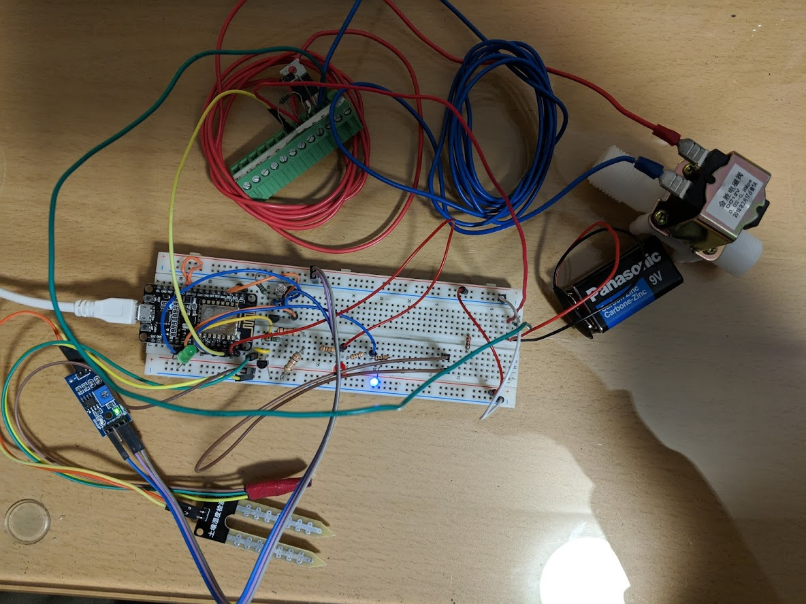
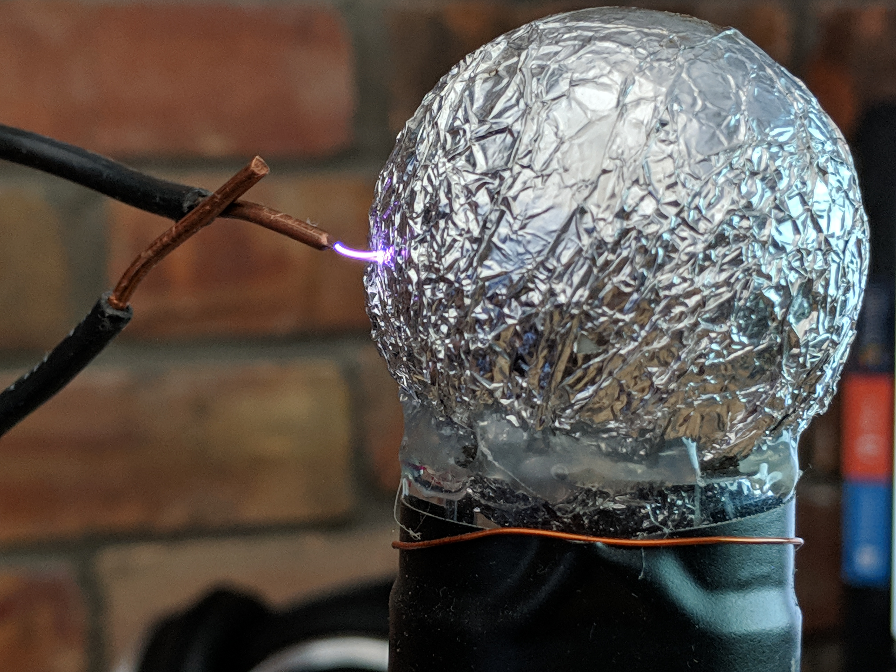

# About me
I'm currently a 3rd-year Computer Engineering Student at McMaster. I'm really interested in working in the IoT space, as well as in AR/VR. I have experience doing web development and robotics from past work experience, projects and competitions. 
 

# Skills

| Used at | Programming | Hardware Development |3D modelling |
| ------- | ----------- | -------------------- | ------------ |
| **Work** |React.js, JavaScript, Vue.js, Java, Go, Git|
| **School** | C, C++, Java,  MATLAB | FPGA, Verilog, PSpice, MATLAB Simulink | Inventor, 3D printing |
| **Personal Projects** | React.js, Vue.js, C, Java | Arduino, Raspberry Pi | Inventor, 3D Printing, Cura |

## Education
BEng of Computer Engineering (CO-OP) | McMaster University | SEPT 2017- APRIL 2021

## Experience

### Full Stack Developer at Ellis Don Enterprise Intelligence Divions

May 2019 – AUGUST 2018

Created responsive and intuitive web applications using React JS and Vue for the Enterprise Intelligence division of EllisDon. Deployed projects using Docker and Kubernetes and used GCP and Azure to run backend services and pipelines for our application.

## Projects

### [IOT Garden Gnome | 2019](https://github.com/saamirt/IOT-Garden-Gnome)
**Skills used: AWS IoT, DynamoDB, C, React.js**

   After realising i was too lazy to go out and water my own garden my buddies and I wanted to create an automated gardening system built on the NodeMCU. Although connecting all these systems to a garden and making it stream data to a website is overkill we desided to pursue this project inorder to learn more about IOT and what it can do. In this project we will be measuring soil moisture, soil and air temperature, and sunlight to determine the best time to water the garden while displaying all the information online so that garden can be monitored remotely. The frontend of the website is built using react.js and streaming will be done using AWS IOT and Dynamo DB. This project is still in developement so please stay tuned for newer developements!

### [Whack-A-Mole AR | 2018](https://github.com/Vithop/Wack-A-Bok) 
**Skills used: Unity, C++, C#**

An Arcade style whack-a-mole game built to be played in augmented reality. Using Google ARcore and Unity game engine we were able to create and environment where players could throw hammers at chickens that pop out of the floor in the space of their room!
•  Built an interactive game built on Unity using googles’ AR core
•	Players can throw weapons at Moles that pop out of the floor in AR

### [DELTA Hack IV: implemented muscle gesture control user interface | 2018]()
**Skills used: C#, Arduino**

•	Using the myo armband’s EMG sensors, 9 axis gyroscope and motion sensors, our team implemented a gesture interface to a 4x4x4 LED cube. Could further be implemented into gesture-controlled robotics.

### [2018 Firelytics](https://test1-fc794.firebaseapp.com/)
**Skills used: GCP, Firebase, JavaScript**

Marketing Analytic Software to optimize the design of marketable products using machine learning. Built during the Google Cloud Sprint Hackathon.

### [Tesla Coil | 2017]()

•	Built a device that generated an electromagnetic resonance field.
•	Can amplify a voltage to create large sparks of lightning as well as power light bulbs wirelessly 

## Contact Info

Feel free to contact me!

 647-447-3024

 mathuransada@gmail.com

 linkedin.com/in/mathuransada/

